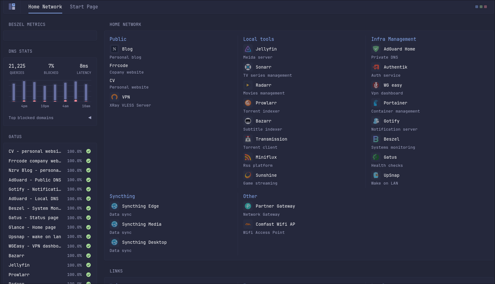

# Building a Home Server

There is a specific kind of joy that comes from opening a browser tab, typing a domain you own, and being greeted by *your* services — not somebody else's SaaS dashboard, not a paywall, not an ad. That joy is the whole point of the so-called *home lab*: a computer in your apartment with an internet connection and a stack of self-hosted software running on it.

This post walks through the full home server setup I have built and refined over a couple of years — the easy first layer (media servers, notifications), the more serious infrastructure layer (DNS, reverse proxies, VPN, identity), and the deeper rabbit hole. The aim is not to push one specific stack, but to give you a mental map of what people actually run at home and why.

## What Even Is a Home Lab?

A *home lab* is just a machine — sometimes a couple of machines — that you run somewhere in your home and host services for yourself. Anything you would normally rent from a SaaS vendor, you can probably self-host: media streaming, photo storage, password managers, file sync, even full Google Workspace replacements via [Nextcloud](https://nextcloud.com/).

The single best starting point for ideas is the [Awesome Self-Hosted](https://github.com/awesome-selfhosted/awesome-selfhosted) repository. Think of any category — RSS readers, mail servers, document editors, media managers — and there is a curated list of open-source options waiting for you.

Why do this at all? A mix of reasons. Some of it is convenience (your TV instantly knows about every movie you have ever downloaded). Some of it is privacy (you stop handing your photo library to Google). Some of it is just the fun of building infrastructure for an audience of one.

## The Overall Shape of the Setup

Before diving into individual services, the topology matters. Here is the high-level data path:

```
Internet
   │
   ▼
Cloudflare (DNS + proxy)
   │
   ▼
Home network — Caddy (reverse proxy)
   │
   ▼
Authentik (SSO / auth gateway)
   │
   ▼
A pile of Docker containers
```

A request comes in from the public internet, hits Cloudflare, gets forwarded to a residential IP, lands on the Caddy reverse proxy inside the home network, gets bounced through Authentik for authentication, and finally reaches the actual service container. Each piece in that chain pulls its own weight.

### Cloudflare

[Cloudflare](https://www.cloudflare.com/) does a lot of things, but for a home lab the relevant pieces are domain registration and DNS proxying. You register a domain (say, `example.dev`), point its A records at your residential IP, and let Cloudflare's proxy sit in front of you. That proxy gives you two things for free: it hides your real IP from casual visitors, and if anyone tries to DoS your home connection, Cloudflare's edge can absorb the brunt of it before it ever reaches your fiber line.

Caveat: Cloudflare's free proxy only forwards a [small whitelist of ports](https://developers.cloudflare.com/fundamentals/reference/network-ports/) — primarily 80 and 443 for HTTP/HTTPS. So if you also want to expose, say, WireGuard on UDP 51820, you have to set that DNS record to "DNS only" (unproxied). Another nuance: Cloudflare's terms of service ([section 2.8](https://www.cloudflare.com/terms/)) restrict serving a disproportionate amount of non-HTML content — large video libraries included — through the proxy. Streaming Jellyfin or Plex through an orange-clouded record is therefore a gray area; the clean workaround is to keep media on an unproxied record or behind your VPN.

### DDNS: Keeping Your Records Pointed at Home

Here is the problem nobody warns you about up front: residential ISPs almost never give you a static IP. Your public address changes whenever the ISP feels like it — a router reboot, a line renegotiation, or just the lease expiring at 3 a.m. The moment it changes, every A record you so carefully pointed at your old IP is now pointing into the void, and the entire setup goes dark until you notice and fix it by hand.

*Dynamic DNS* (DDNS) is the fix. A small agent runs on your network, watches your current public IP, and pushes the new value to Cloudflare's API the instant it changes. Your DNS records follow your connection automatically.

This is not an optional nicety — it is what holds the whole house of cards together. Every layer below this point (the reverse proxy, SSO, remote VPN access) assumes the domain resolves to your house. Break that assumption and nothing else matters.

A couple of common ways to run it:

- **[cloudflare-ddns](https://github.com/timothymiller/cloudflare-ddns)** — a tiny container that polls your IP and updates one or more Cloudflare records on a schedule. Set it and forget it.
- **Router-native DDNS.** Many routers (and OPNsense/pfSense) ship a built-in DDNS client with a Cloudflare provider. Running it on the router is arguably the most reliable spot, since the router is the device that actually sees the WAN address first.

Whichever you pick, run it on the always-on edge box (or the router itself), not on a machine that reboots — the same logic that applies to DNS applies here.

### Caddy (Reverse Proxy)

[Caddy](https://caddyserver.com/) is the front door. Its job, like any reverse proxy, is to take an incoming HTTP request, look at the `Host` header, and forward the request to the right backend container. A minimal `Caddyfile` snippet for a home setup looks like this:

```caddy
{$DOMAIN} {
    @home host home.{$DOMAIN}
    handle @home {
        reverse_proxy glance:8080
    }

    @media host media.{$DOMAIN}
    handle @media {
        reverse_proxy jellyfin:8096
    }
}
```


### Authentik (Single Sign-On)

[Authentik](https://goauthentik.io/) is an open-source identity provider that speaks OIDC, SAML, and LDAP. You can read more about it in my lecture [Reverse Proxy and OIDC: Your First Line of Defence](/posts/reverse-proxy-authentik-oidc-cloudflare#putting-auth-at-the-proxy). Its most useful trick is the *forward auth* pattern: Caddy delegates authentication for every request to Authentik before the request hits the actual service. If you do not have a valid session cookie, you get a login screen — regardless of which container you were trying to reach.

The result: a single login screen sits in front of every exposed service, even ones that have no built-in auth at all. If a stranger tries to load `home.example.dev`, they hit the Authentik login wall, not your dashboard.

This is crucial if you expose your services to the internet. Another approach is to keep services reachable only inside your network and use a VPN like WireGuard to get back in from the outside.

### The Dashboard


The little landing page that ties it all together is [Glance](https://github.com/glanceapp/glance) — a small, dependency-free Go app that renders a dashboard from a single YAML file. No accounts, no database, no auth. Just a grid of links and widgets.

```yaml
pages:
  - name: Home
    columns:
      - size: small
        widgets:
          - type: bookmarks
            groups:
              - title: Media
                links:
                  - title: Jellyfin
                    url: https://media.example.dev
                  - title: Sonarr
                    url: https://sonarr.example.dev
```

Glance is intentionally minimal. If you want fancier (RSS feeds embedded in the dashboard, weather widgets, Plex-now-playing tiles), it can do that too via the same YAML.

## Layer One: Media

For most people, the gateway drug into home labs is a media server.

### Jellyfin and Plex

[Jellyfin](https://jellyfin.org/) is the fully open-source option. [Plex](https://www.plex.tv/) is older, more polished, and partially closed-source (and recently went paid for remote streaming). Both do the same basic thing: point them at a folder of legally acquired video files, and they will scrape metadata, generate thumbnails, group episodes into seasons, and stream the result to whatever client you want — phone, TV, browser, PlayStation.

The clever bit is that the parsing is filename-driven. You drop `Breaking.Bad.S01E03.1080p.mkv` into the right folder, and the server figures out which show and episode it belongs to from the filename, then enriches it with data from external metadata providers like [TheTVDB](https://thetvdb.com/) or [TMDB](https://www.themoviedb.org/). You can run Jellyfin and Plex side by side on the same library — they will both happily index the same folder.

Both services have native apps for Android TV, Apple TV, Roku, PlayStation, basically anything with an HDMI port and a CPU. That is the whole pitch: Netflix-like experience, your library, no monthly fee.

## The *arr Stack: Automating the Library

> **A note for the lawyers in the room.** Everywhere this post mentions torrents, indexers, or trackers, it is of course referring exclusively to media that is freely and legally available, public-domain works, Linux ISOs, and content you already own and are simply re-acquiring for your own convenience (where your local laws permit). The *arr stack* is a general-purpose automation tool; what you point it at is between you and your jurisdiction. Know the rules where you live, and act accordingly.

This is where things get interesting. Manually downloading and organizing files works for a while; eventually you want automation.

The *\*arr stack* is a family of related applications, all ending in "-arr", that handle media management:

| Service | Handles |
| --- | --- |
| [Sonarr](https://sonarr.tv/) | TV shows |
| [Radarr](https://radarr.video/) | Movies |
| [Lidarr](https://lidarr.audio/) | Music |
| [Readarr](https://readarr.com/) | Books |
| [Bazarr](https://www.bazarr.media/) | Subtitles |
| [Prowlarr](https://prowlarr.com/) | Indexer aggregator |

Sonarr and Radarr are the workhorses. You give them a show or movie, and they will:

1. Search a list of indexers for releases.
2. Pick a release that matches your quality preferences (e.g. "1080p Blu-ray, skip CAM rips").
3. Hand the magnet/torrent to your download client.
4. Wait for it to finish.
5. Rename and move the file into the correct folder.
6. Notify you when it is done.

They also track upcoming releases — Sonarr has a calendar view that pulls premiere dates from TheTVDB, so a new episode of *Rick and Morty* lands on your server the moment it airs.

### Quality Profiles

One of the nicer Sonarr features is the quality profile system. You specify which qualities you accept, in priority order. A profile that filters out cam rips looks like:

```
Allowed qualities:
  ✓ Bluray-1080p   (priority 1)
  ✓ WEBDL-1080p    (priority 2)
  ✓ WEBRip-1080p   (priority 3)
  ✓ HDTV-1080p     (priority 4)
  ✗ CAM
  ✗ TELESYNC
  ✗ DVDScreener
```

If Sonarr finds a release outside that list, it will mark it with a little warning indicator instead of auto-downloading it. You can still pull it manually via "Interactive Search" if you want.

### Prowlarr: The Indexer Layer

Sonarr and Radarr do not talk to torrent trackers directly. Instead, they both talk to [Prowlarr](https://prowlarr.com/), which centralizes the list of indexers (public ones like The Pirate Bay, private trackers, Usenet providers) and exposes them through a unified API. Add a tracker once in Prowlarr, and every -arr service sees it.

This separation of concerns is what makes the stack flexible: if you only want media management on an existing library (no downloading), you skip Prowlarr entirely. If you only want torrent search without media organization, you can run Prowlarr standalone.

### Trakt Integration

[Trakt](https://trakt.tv/) is a closed-source service for tracking what you have watched, what you want to watch, and getting recommendations. Both Sonarr and Radarr can sync Trakt lists: anything you mark as "want to watch" on Trakt gets queued for automatic download. It is just one example — you can wire in any number of other services. The point is simply that the \*arr stack is designed to be plugged into the rest of your flow.

### Download Clients

The -arr stack delegates the actual downloading to a download client. Common choices:

- [Transmission](https://transmissionbt.com/) — lightweight, just works.
- [qBittorrent](https://www.qbittorrent.org/) — more features, more options.
- [Deluge](https://www.deluge-torrent.org/) — plugin ecosystem.

Each runs as its own container alongside Sonarr/Radarr. Sonarr hands the torrent over via API; the download client does its thing; Sonarr notices the file landed and moves it into the library.

## Notifications: Gotify and NTFY

You will want push notifications for "new episode available" or "your server is on fire". Two good self-hosted options:

- [Gotify](https://gotify.net/) — Android-only client, uses Google Cloud Messaging. Free, simple, works.
- [NTFY](https://ntfy.sh/) — cross-platform (including iOS), slightly more features.

Both are essentially just HTTP servers that accept POST requests and forward them to your phone as push notifications. The shape of the API is dead simple:

```bash
curl -H "Title: Build finished" \
     -H "Priority: high" \
     -d "All tests passed" \
     https://ntfy.example.com/build-status
```

This means you can plug *anything* into it. Sonarr has built-in support for both. A shell script can pipe its output through it. A cron job can ping it on failure. Composing them works too:

```bash
long-running-task | xargs -I{} curl -d "{}" https://ntfy.example.com/tasks
```

The mental model: every service that knows how to make an HTTP call can now reach your lock screen.

## Layer Two: Infrastructure

The first layer was about convenience. The second layer is about treating your home network like real infrastructure.

### Private DNS: AdGuard Home or Pi-hole

[AdGuard Home](https://adguard.com/en/adguard-home/overview.html) and [Pi-hole](https://pi-hole.net/) are network-level DNS servers. You point your router at one of them, every device on the network uses it for DNS resolution, and you get three big wins:

1. **Local domain names.** You can define internal-only records like `media.internal` that resolve to a private IP. No more typing `192.168.1.21:8096` into a browser.
2. **Network-wide ad blocking.** Both servers come pre-loaded with block lists of ad/tracking domains. Every device on the network — phones, smart TVs, fridges — gets ad-blocked for free. Mobile games and apps lose their ads. The notable exception is Instagram, which serves ads from the same domain as regular posts.
3. **DNS-over-HTTPS / DNS-over-TLS** if you want encrypted resolution upstream.

AdGuard Home supports wildcard records (e.g. `*.internal`), which Pi-hole historically does not — that is the main reason to pick one over the other.

**Critical gotcha:** *do not* run your DNS server on the same machine as your other home services. If that machine reboots, the entire household loses DNS, which means the entire household loses internet. Run AdGuard/Pi-hole on a dedicated tiny edge box (an old Raspberry Pi, a fanless mini-PC). Treat it as critical infrastructure.

### WireGuard: VPN Back Into Your Network

If you do not want to expose every service to the public internet, [WireGuard](https://www.wireguard.com/) gives you a tiny, fast, modern VPN to tunnel back into your home network from anywhere.

The easiest way to run it is via [wg-easy](https://github.com/wg-easy/wg-easy), a container that gives you a web UI for managing peers. Create a new peer, get a QR code, scan it from your phone's WireGuard app, done. From then on, your phone can resolve `192.168.1.x` addresses as if it were sitting on the couch.


**Router gotcha:** for WireGuard (or anything else that lives outside ports 80/443), you need to configure port forwarding on your router. NAT is what makes this necessary — your home devices all share one public IP, and the router needs an explicit rule saying "UDP port 51820 goes to the WireGuard machine at 192.168.1.5".

**Android gotcha:** Android caches DNS configuration aggressively. If you connect over WireGuard and your local DNS records do not work for the first ~30 minutes, that is why. The behavior has reportedly improved in recent Android versions, but it is a known pain point.

### Two Machines, Not One

The recommended split:

- **Edge box.** Small, low-power, fanless. Runs AdGuard Home, Caddy, Authentik, WireGuard. The "always-on critical infrastructure" tier.
- **Media box.** More CPU, more RAM, more disk. Runs Jellyfin, the *arr stack, Transmission, photo library, etc.

This isolates the boring stuff that must never go down from the heavy stuff that periodically reboots, fills its disk, or crashes during a transcode.

For orchestration, [Docker Swarm](https://docs.docker.com/engine/swarm/) is a lightweight way to manage containers across both nodes from a single control plane. Caddy on the edge node can transparently reverse-proxy to containers running on the media node. Kubernetes also works, but is overkill for two machines.

## Layer Three: The Deep End

This is where the home lab stops being a media setup and starts being a personal cloud.

### Immich: Self-Hosted Google Photos

[Immich](https://immich.app/) is the open-source Google Photos clone that has finally gotten good. It does:

- Mobile app auto-upload (Android + iOS).
- Face recognition (locally, on CPU or GPU).
- Object detection ("find all photos of clocks").
- OCR over photos for text search.
- Timeline view, map view, albums, shared links.
- Memories ("on this day, 3 years ago").
- Deduplication.

The deduplication piece is the actual differentiator versus Google Photos: Google has every incentive *not* to dedupe so you fill your quota faster. Immich does not care.

The face recognition uses [machine learning models](https://immich.app/docs/features/ml-hardware-acceleration/) that run on the server. GPU support exists but mostly improves speed, not accuracy. For a normal personal library — 10–20 photos a day getting uploaded — CPU inference at night is plenty.

Bulk import works: dump your Google Takeout archive into Immich's external library folder, and it will index everything. 

### OwnCloud / Nextcloud

[Nextcloud](https://nextcloud.com/) is the heavy enterprise option — file sync, contacts, calendar, document editing, video calls. [OwnCloud](https://owncloud.com/) is the older lighter cousin (Nextcloud is actually a fork of it).

For pure file sync, both have good desktop and mobile clients. The Android sync is notoriously fiddly though — the recommended fix is to use a third-party app like [FolderSync](https://foldersync.io/) instead of the official client. FolderSync handles bidirectional folder sync with WebDAV/SFTP/S3 backends and tends to be more reliable than the official OwnCloud Android app.

### Syncthing: Peer-to-Peer File Sync

[Syncthing](https://syncthing.net/) is a fundamentally different model from OwnCloud. There is no central server — every device is a peer, and folders sync directly between them. I use it to sync my Obsidian Vault: a `.md` directory on the phone, the desktop, the Mac, the media server, and the edge server. Edit anywhere, see the change everywhere.

Because every peer holds a full copy, you also get automatic backup distributed across all your devices.

### Excalidraw + ExcaliDash

[Excalidraw](https://excalidraw.com/) is a fantastic whiteboarding tool, but the free hosted version stores diagrams only in browser local storage. That means switching from your home machine to your work machine requires exporting and importing a file. [ExcaliDash](https://github.com/ZimengXiong/ExcaliDash) fixes this: it is a self-hosted dashboard and organizer that wraps Excalidraw with a proper backend. Diagrams persist to a database (SQLite by default, external DBs supported) in the portable `.excalidraw` format, and you get collections, drag-and-drop organization, and full-text search across everything you have drawn. It also adds real-time collaboration with live presence, automatic version snapshots you can preview and restore, scoped internal/external share links, and optional multi-user login via native credentials or OIDC — which slots neatly into the Authentik setup from earlier.

### Home Assistant

[Home Assistant](https://www.home-assistant.io/) is the open-source home automation hub. It does not directly control anything — it talks to *integrations* that talk to actual devices (Zigbee bulbs, Wi-Fi thermostats, IR blasters, motion sensors, etc.) and presents a unified API and dashboard.

Useful patterns:

- **IR blaster for "dumb" appliances.** Devices like the [Broadlink RM4](https://www.ibroadlink.com/) (~$15) can learn IR codes from any old remote and replay them. Suddenly your decade-old air conditioner is voice-controllable.
- **Geofencing automations.** If you have the Home Assistant companion app on your phone, it knows your location. "When I'm within 500m of home and the indoor temperature is above 30°C, turn on the AC."
- **Voice assistant integrations.** Home Assistant exposes its entities through Google Assistant, Alexa, or local options like [Rhasspy](https://rhasspy.readthedocs.io/).

**Hardware advice:** avoid the cheapest Chinese smart devices, especially anything branded under the [Tuya](https://www.tuya.com/) ecosystem. Tuya devices route commands through their cloud servers, which adds noticeable latency (you press "on" and the bulb thinks about it for 2 seconds). Look for devices that support local control via [Zigbee](https://www.home-assistant.io/integrations/zha/), [Z-Wave](https://www.home-assistant.io/integrations/zwave_js/), or [Matter](https://www.home-assistant.io/integrations/matter/).

## Monitoring and Mundane Quality-of-Life

A few smaller services worth knowing about:

- **[Portainer](https://www.portainer.io/)** — a web UI for managing Docker containers. Restart things, tail logs, check resource usage without SSH. Genuinely useful even if you live in the terminal.
- **[Beszel](https://beszel.dev/)** — lightweight host monitoring. CPU, memory, disk, network per node. ~24 MB of memory.
- **[Gatus](https://github.com/TwiN/gatus)** — uptime monitoring with a public status page. Configured entirely in YAML. Crucially, it is *much* lighter than [Uptime Kuma](https://github.com/louislam/uptime-kuma), which famously needs ~800 MB of RAM just to sit idle.
- **[Miniflux](https://miniflux.app/)** — a minimalist self-hosted RSS reader server. Pair with any RSS app on your phone. The original web of "I subscribe to actual websites" still works if you let it.
- **[UpSnap](https://github.com/seriousm4x/upsnap)** — a Wake-on-LAN front-end for waking sleeping desktops over the network.

## A Bonus: Game Streaming with Sunshine + Moonlight

This one is not strictly part of the home server, but the pattern is the same: a powerful machine at home, a thin client wherever you happen to be.

[Sunshine](https://github.com/LizardByte/Sunshine) is an open-source game streaming host (the open replacement for NVIDIA GameStream after NVIDIA deprecated it). [Moonlight](https://moonlight-stream.org/) is the corresponding client. The model: install Sunshine on your gaming PC, install Moonlight on an Android TV box, a phone, a Mac, whatever — then stream your games over LAN. With a wired gigabit link, the latency is genuinely fine for everything short of competitive FPS. With Wi-Fi 6 in the same room, it is fine for turn-based games and most action games.

[Parsec](https://parsec.app/) is a closed-source alternative that works similarly and supports more platforms out of the box; pick whichever you prefer.

**Hardware caveat for Sunshine:** if your gaming PC has only one display attached and you stream to a TV with a different resolution, things get weird (you end up streaming a 4K signal scaled to a 1080p TV, or vice versa). The fix is either a cheap HDMI dummy plug (~$3, pretends to be a second monitor) or a [virtual display driver](https://github.com/itsmikethetech/Virtual-Display-Driver). Solves a surprising amount of grief.

## Practical Recommendations for Going Down This Path

A few things to internalize before you start clicking "deploy":

1. **Put DNS on its own box.** The single most reliable way to ruin your weekend is to take down your DNS server while trying to update your media stack.
2. **Use Docker / Docker Compose from day one.** Every service in this post runs as a container. Skipping containers makes upgrades and reproducibility painful.
3. **Write your configs as code.** Whether you use [Ansible](https://www.ansible.com/), shell scripts, or just commit your `docker-compose.yml` files to a repo, you want to be able to reproduce the whole setup from scratch. My own setup lives in a [public repo](https://github.com/petr-nazarov/infrastructure) — and you might wonder how it can be public when it is full of API keys, OIDC client secrets, and database passwords. The answer is [SOPS](https://github.com/getsops/sops): every secret in the repo is encrypted at rest, so the plaintext never touches Git. SOPS encrypts only the *values* in a YAML/JSON/`.env` file (leaving the keys and structure readable), backed by an [age](https://github.com/FiloSottile/age) or GPG key that stays off the repo. The result is that I can version-control the entire home lab — secrets included — in the open, and a freshly cloned machine with the decryption key can stand the whole thing back up.
4. **Back up off-site.** RAID and SnapRAID protect you from disk failure. They do not protect you from fire, theft, flooding, or accidentally `rm -rf`-ing your library. Pay a few dollars a month for off-site backup.
5. **If you care about the data, do not use USB-attached drives.** They are unreliable. Use SATA controllers.
6. **Start small.** Jellyfin and AdGuard Home together cover 80% of what most people actually want from a home server. Add more services only when you have a clear use case.

If you want a single resource to deep-dive into the *arr stack specifically, the [TRaSH Guides](https://trash-guides.info/) are the gold standard — exhaustive documentation on naming schemes, quality profiles, indexer setup, and best practices.

## Closing Thought

The fun part of a home lab is not the specific services. It is the slow realization that you can replace almost any consumer SaaS product with something you run yourself, and that the gap in polish has narrowed dramatically in the last few years. Immich genuinely competes with Google Photos. Jellyfin genuinely competes with Netflix's UI. Authentik genuinely competes with Okta.

You will not save money doing this. You will spend a non-trivial number of evenings debugging Docker networking and explaining to family members why the TV "doesn't work" because you redeployed Jellyfin in the middle of a movie. But the upside — owning your own infrastructure, controlling your own data, and learning a real amount of practical sysadmin along the way — is hard to get any other way.


