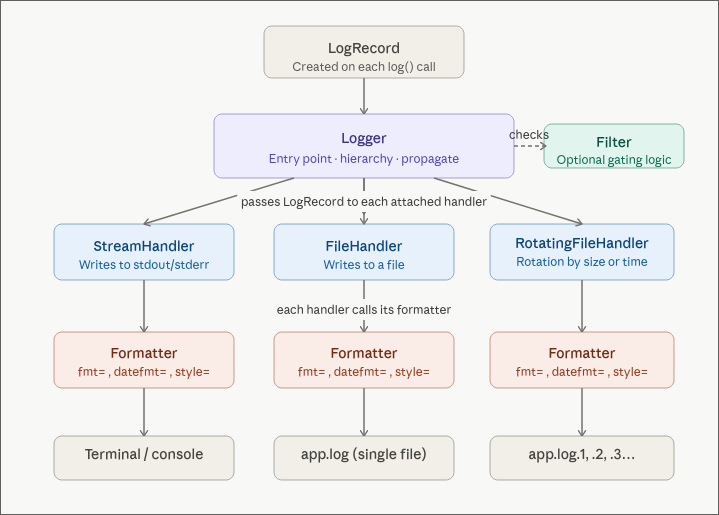

Everyone writes logs. A `printf` is a log. A `console.log` is a log. But there's a big gap between "something gets printed in the terminal" and a logging setup that actually helps you understand what your app is doing in production. This post is about closing that gap.

## The Logging Architecture


### Handlers: where your logs go

A logger routes entries through one or more **handlers**, and each handler decides where the log ends up:

- **StreamHandler** writes to stdout. This is usually the default.
- **FileHandler** writes to a file on disk.
- **RotatingFileHandler** writes to a file and rotates it by size or time. Without rotation you'll fill the disk eventually.

Use multiple handlers at the same time. Console for local dev, file for persistence, both fed by the same logger.

### Formatters: how your logs look

A formatter controls the shape of each entry. The same `lg.info("something happened")` can produce wildly different output depending on which handler picks it up.

For console output during development you want something readable:

```
12:00:00 myService something happened
```

For files and downstream processing you want structure. The format I default to is **JSON Lines** (also called JSONL or newline-delimited JSON). Each line is a complete, self-contained JSON object:

```json
{"timestamp":"2026-04-16T12:00:00.123Z","service":"myService","level":"info","message":"something happened","request_id":"abc-123","machine_id":"prod-1","container_id":"d4e5f6","version":"a1b2c3d","region":"eu-west-1","pid":1234}
{"timestamp":"2026-04-16T12:00:00.456Z","service":"myService","level":"info","message":"order placed","request_id":"def-456","machine_id":"prod-1","container_id":"d4e5f6","version":"a1b2c3d","region":"eu-west-1","pid":1234}
```

Why not a proper JSON array? Because log streams never close. There's no final `]` to write when your app keeps running. With JSONL each line stands on its own and any collector can ingest it.

A common question: *can I pipe JSONL through `jq`?* Not directly, `jq` wants valid JSON. You'd have to wrap the lines in brackets and add commas. The better answer is: don't write JSONL to your console. Use a readable formatter for stdout and JSONL for files. You get both by attaching different formatters to different handlers.

### Filters: what gets written

Filters let you drop entries conditionally. A typical one:

```python
def my_filter(record):
    if record.level < DEBUG and env != "local":
        return False
    return True
```

Filters are also a good place to redact sensitive data — passwords, tokens, anything you don't want hitting disk.

## Log Levels

Log levels are just a convention for severity. The standard hierarchy:

| Level    | Value | When to use |
|----------|-------|-------------|
| DEBUG    | 10    | Local dev, step-by-step tracing |
| INFO     | 20    | Normal operations: `user created`, `order placed` |
| WARNING  | 30    | Something abnormal but non-fatal: an upstream API not responding |
| ERROR    | 40    | Something broke and needs attention |
| CRITICAL | 50    | In theory: total service failure. In practice your customers will tell you before your logs do. |

Levels are numeric so you can compare them: `if log_level >= WARNING` catches warnings, errors, and critical events in one check.

One custom level worth adding: a **SUCCESS** level (value 25, between INFO and WARNING), printed in green. A long-running script that finishes silently is a source of anxiety. An explicit green "completed successfully" line costs nothing and pays off every time.

## Structured Logging with Extra Fields

A common anti-pattern:

```python
lg.info(f"Image {index} of {total} downloaded successfully")
```

This produces a string you can't query. Use **extra fields** instead:

```python
lg.info("image downloaded successfully", extra={"index": 1, "total": 10})
```

The `extra` dict ends up as searchable, filterable fields in your JSON output. Stuff anything useful in there — `run_id`, business context, entity names, whatever helps you find the log later.

Same idea everywhere. Don't write:

```python
lg.info(f"Order {order_id} placed by user {user_id} for amount {amount}")
```

Write:

```python
lg.info("order placed", extra={"order_id": order_id, "user_id": user_id, "amount": amount})
```

### What goes on the top level?

There's no universally accepted standard for log field names. The closest is the [Elastic Common Schema](https://www.elastic.co/guide/en/ecs/current/index.html) (ECS), but it's mostly designed for Elasticsearch. Most aggregators (Datadog, Loki, etc.) parse whatever JSON you give them, so you don't really need to conform to any schema.

That said, some fields are basically required: `timestamp`, `level`, `service`, `message`. After that, `request_id`, `machine_id`, `container_id`, `version` (git commit hash), `region`, and `pid` are all worth adding.

## Request ID Propagation

In any system with a frontend, backend, and background workers, you need a way to follow a single user action across all the moving parts. That's what **request IDs** are for.

The flow:

1. The **frontend** generates a [UUID](https://en.wikipedia.org/wiki/Universally_unique_identifier) and attaches it as a header on the request.
2. **Backend middleware** reads the header. If it's missing, generate one so you at least have tracing on the backend side.
3. The request ID goes into a **request context** scoped to the lifetime of that request.
4. Every log entry produced during that request includes the request ID automatically.

In Python with [FastAPI](https://fastapi.tiangolo.com/) I use [`contextvars`](https://docs.python.org/3/library/contextvars.html). In Node with Express it's the `ctx` object. The idea is the same: a "global" that's actually isolated to the current request.

```python
# Middleware pseudocode
request_id = request.headers.get("X-Request-ID") or str(uuid4())
request_context.set(request_id=request_id)

# Same place is good for decoding the JWT and stashing the user
decoded_token = decode_jwt(request.headers.get("Authorization"))
request_context.set(user_id=decoded_token.user_id)
```

Then configure the logger to pull `request_id` and `user_id` from the context for every entry. No need to thread these through every controller and service function.

When something breaks, you grep for one request ID and get the whole story: what the user did on the frontend, how the backend handled it, where it fell over.

## The Write Path: Backpressure and Performance

Writing logs is I/O, and I/O is slow. If every `lg.info()` blocks until the entry is flushed, your app slows down for no good reason.

A decent `RotatingFileHandler` uses an internal queue: entries are enqueued immediately and written to disk asynchronously in batches. The implications:

- Your app doesn't block on log writes.
- Entries can appear slightly out of order (you have timestamps, sort by those).
- Under extreme load you might lose logs. Accept it. Better than crashing because the logger couldn't keep up.

Even stdout is I/O. Try removing all `print` statements from a script that logs heavily and you'll see a measurable speedup. Ideally even your StreamHandler uses backpressure.

## Log Collection and Storage

Logs sitting in files on a single machine aren't very useful. You need a **log collector**: a sidecar that tails your log files and ships them to a central store.

### The Grafana Stack

Using [Grafana](https://grafana.com/) as the example:

- [Loki](https://grafana.com/oss/loki/) is the collector and storage engine. It runs alongside your app, reads log files (or Docker stdout), and stores them in its own database. It can also filter and reformat during ingestion.
- Grafana is the visualization layer. It's a thin client that queries Loki and renders dashboards. Grafana itself stores nothing.

```
Application -> Log Files -> Loki -> Grafana
                                      |
                                   Dashboards
                                   Alerting
```

Other collectors like [Vector](https://vector.dev/) and [Fluentd](https://www.fluentd.org/) work the same way and can swap in for Loki.

### Long-term storage with S3

If your machine dies, your logs die with it — unless you're backing them up. Loki can be configured to write to [S3](https://aws.amazon.com/s3/) (or any S3-compatible store) for durable, off-machine storage.

S3 also gives you storage tiers for cost:

- Hot/warm for the first 7 days (fast).
- Cold after that (cheaper, slower).

Grafana queries Loki, Loki queries S3. The latency is a bit higher for archived data but in practice you don't notice it.

## Types of Logs

### Application logs

Everything we've covered so far — structured entries from your application code.

### Access logs (reverse proxy logs)

Separate from application logs. They come from your reverse proxy ([Caddy](https://caddyserver.com/), [Nginx](https://nginx.org/), etc.) and record every request to your server: who, which endpoint, response code, response time, bytes transferred.

These are useful for:

- Security: spotting attack patterns, blocking IPs.
- Auditing: who accessed what data.
- Compliance: proving who accessed what data, on a specific date, with a paper trail.

Most reverse proxies do access logging out of the box. Just collect them as a separate category.

Typical retention: access logs are kept for around 2 years, application logs for around 3 months.

## WORM Compliance

Once you start working with enterprise clients, subcontractors, or anything in a regulated industry, compliance shows up. Two common scenarios:

1. **Data access auditing.** Compliance needs to see who touched sensitive data.
2. **SLA disputes.** Something broke and you need logs to prove what happened. If there's a million dollars on the line, the temptation to "edit" the logs is very real.

What stops someone from quietly deleting inconvenient logs and writing new ones? **WORM: Write Once, Read Many.**

WORM is a storage mode where data can be created but never modified or deleted. S3 supports it with **Object Lock**:

```
S3 Bucket (Object Lock enabled)
  -> Logs can be written
  -> Logs cannot be modified or deleted
  -> Retention policy: e.g., 2 years
```

With Object Lock the integrity of your logs is guaranteed by S3, not by your team's good intentions. S3 also handles retention policies, so the lifecycle is managed for you.

## Monitoring with Prometheus

Logs are text records of events. **Monitoring** is about numeric metrics over time: CPU, memory, disk I/O, network, container resource usage, and so on.

In the Grafana ecosystem, [Prometheus](https://prometheus.io/) is the metrics collector. It:

- Scrapes metrics from your machines and containers.
- Stores time-series data in its own DB.
- Feeds Grafana for visualization.

Prometheus isn't only for infra. You can point it at your database and track business metrics too — user growth, order volume, whatever your product team cares about.

### The actually useful part

What I find most useful is combining logs and metrics on the same dashboard. You see a CPU spike at 8:40 AM in the metrics panel, select that window, and the logs panel immediately shows what the app was doing at that moment. That correlation is the main reason to invest in a unified observability stack at all.

## Simple Alternatives

Not every project needs Grafana + Loki + Prometheus. A few lightweight, self-hosted options I like:

### [Dozzle](https://dozzle.dev/) for logs

A single Docker container that reads logs from all your other containers via the Docker socket. No config required. It keeps a small temporary DB so logs survive container restarts. Perfect when you just want to see what's happening.

### [Beszel](https://github.com/henrygd/beszel) for monitoring

All-in-one: collects metrics and renders dashboards. Shows CPU, memory, disk I/O, temperature, network, and GPU usage broken down by container. One Docker Compose file and you're done. Covers maybe 90% of what small setups need.

### [Netdata](https://www.netdata.cloud/), an opinionated take

Combines logs and metrics in a pre-configured UI. Think Grafana with batteries included. Downside: not fully open-source and pretty pushy about its paid tier.

## A Note on OpenTelemetry

[OpenTelemetry](https://opentelemetry.io/) (OTel) wants to be a unified standard for logs, metrics, and traces. The pitch is good — standardize the format and collection so tools become interchangeable.

In reality, mature end-to-end OTel implementations are still rare. The pragmatic approach today: read the spec, understand the naming conventions and data model, and structure your own logging to align with OTel where it's cheap to do so. ECS happens to be OTel-friendly, so it's a fine starting point.
