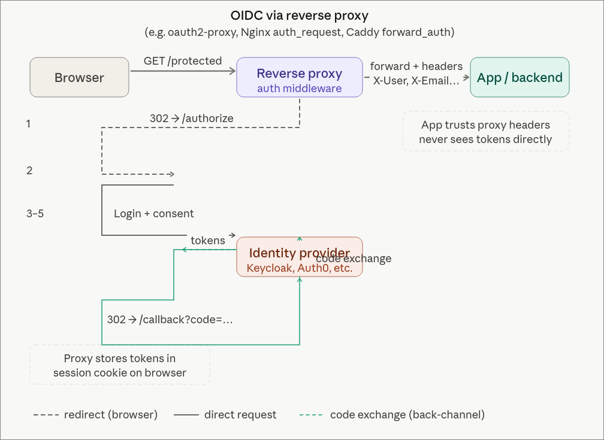
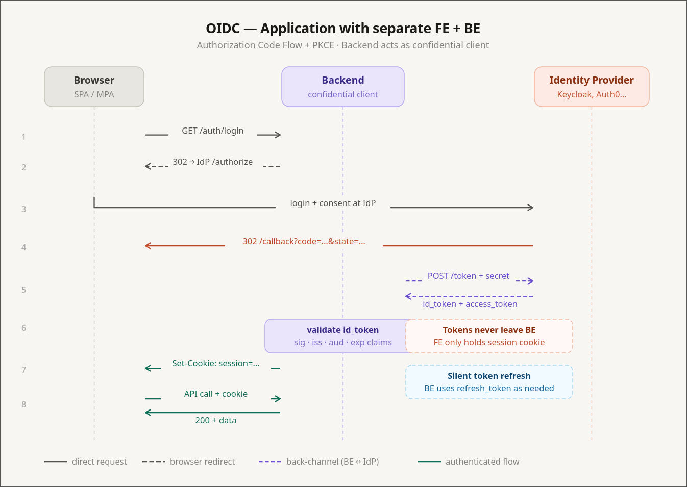

Auth is the part of every web project nobody wants to touch. Login forms, password resets, sessions, role checks — it's tedious, and worse, it's the kind of code where one bad line turns into a CVE.

The trick is that for most projects you don't have to write any of it. A reverse proxy, an identity provider you didn't build, and Cloudflare on top will give you something more secure than what you'd hand-roll, with a tiny fraction of the code.

This is the stack I actually run on my home server and at work. I'll go layer by layer and point out where each one stops being enough.

## What a reverse proxy does

The name is awkward, but the job is simple. You point `myserver.com` at an IP, the request hits your machine, and *something* on the box has to figure out which service is supposed to answer. That something is the reverse proxy.

It looks at the request — host, path, headers — and forwards it. The destination might be:

- another process on the same machine (`api.myserver.com` → port 3000, `myserver.com` → port 8080),
- a service on a different machine in your LAN,
- or a completely external host (`old.myserver.com` → `google.com`, if you're feeling weird).

The four you'll run into are [Apache](https://httpd.apache.org/), [Nginx](https://nginx.org/), [Caddy](https://caddyserver.com/), and [Traefik](https://traefik.io/). I'll use Caddy here because the config is the easiest to read.

A minimal Caddyfile:

```caddy
example.com {
    root * /srv
    file_server
    header Cache-Control "max-age=3600" {
        match {
            path *.css *.js *.png *.jpg
        }
    }
}

api.example.com {
    reverse_proxy localhost:3000
}
```

Two domains, one box, two completely different behaviours. The first serves static files from `/srv`, the second forwards traffic to a local API. Caddy fetches and renews Let's Encrypt certificates for both on its own, which is most of why I switched.

A more realistic homelab Caddyfile, with a bunch of Docker containers behind one proxy, looks closer to this:

```caddy
rss.{$DOMAIN} {
    reverse_proxy miniflux:8080
    import mytls
}

ntfy.{$DOMAIN} {
    reverse_proxy gotify:80
    import mytls
}
```

Each service gets a subdomain, the proxy fans out the traffic, and a shared `mytls` snippet handles TLS for everything.

So far it's just routing. The interesting question is what else you can do once every request has to pass through the same chokepoint.

## Putting auth at the proxy



The first thing you can do is block requests. IP allowlists are the trivial case, but the more useful move is to make the proxy ask "who are you?" before forwarding anything to the service behind it.

The piece that answers that question is an **identity provider** — an IDP. The IDP sits in front of your reverse proxy. Every request hits the IDP first. If the user is logged in, the request goes through; if not, they get bounced to a login page. The protected service never sees an anonymous request.

There are a few you'll run into:

- **[Authentik](https://goauthentik.io/)** — self-hosted, easy to run, what I use at home.
- **[Keycloak](https://www.keycloak.org/)** — also self-hosted, very enterprise-friendly, plays nicely with corporate Active Directory.
- **[Auth0](https://auth0.com/)** — hosted, the default pick if you'd rather pay than operate.
- **[Descope](https://www.descope.com/)** — hosted, with a nice visual flow editor for the login UI.
- **[Microsoft Entra ID](https://www.microsoft.com/en-us/security/business/identity-access/microsoft-entra-id)** — what used to be Azure AD. The Microsoft-shop default.

The pattern is the same across all of them: redirect unauthenticated users to the IDP, let the IDP do the login, get a signed token back. I'll use Authentik for the example because that's what I run, but everything below has a direct equivalent in the others.

In Caddy you wire Authentik up with two snippets. First, a block that lets Authentik handle its own auth flow under `/outpost.goauthentik.io/`:

```caddy
(authentik) {
    reverse_proxy /outpost.goauthentik.io/* authentik:9000
    forward_auth authentik:9000 {
        uri /outpost.goauthentik.io/auth/caddy
        copy_headers X-Authentik-Username X-Authentik-Groups X-Authentik-Email
    }
}
```

Then one line in any service block you want to protect:

```caddy
home.example.com {
    import authentik
    reverse_proxy homepage:3000
}
```

That's it. The `homepage` service has no idea auth exists. It thinks it's a dumb HTML app running on localhost. But the only way anyone is reaching it is through Authentik's login screen.

This is great for self-hosted dashboards and internal tools that have no auth, or have bad auth you don't want to trust. You get login, MFA, group management, social logins (Google, GitHub, Yandex, whatever) without changing a line of code in the protected app.

## Where proxy auth stops working

Proxy-level auth is binary. Either you're allowed in, or you're not. That's perfectly fine for "is this person allowed to see my Grafana?", and it falls apart the moment your app has roles.

If admins need to see a panel that regular users don't, the proxy can't help you. The proxy doesn't know what a panel is. The application has to know who the user is and what they're allowed to do.

What you don't want is for "the application has to know" to mean "I write a login flow again". The way out is for the IDP to also issue tokens, and for your app to consume them. The standard for that is OpenID Connect — but to talk about OIDC properly, we need to talk about JWTs first.

## A short JWT primer

A [JSON Web Token](https://jwt.io/) is three base64 chunks separated by dots: a header, a payload, and a signature. The useful trick is asymmetric in a specific way:

- **Anyone** can read the payload. It's literally base64. Nothing about the contents is secret.
- **Only the holder of the signing key** can produce a token whose signature checks out.

That's the whole thing. The payload is plaintext to anyone who has the token. What you get from the signature is *integrity* — your server can prove the token was issued by something holding the signing key, and that nobody has tampered with the payload since.

Which means the server is allowed to *trust* what's inside. If the JWT says `"role": "admin"` and the signature verifies, that user is an admin. You don't need to ask the database to confirm it, because the only thing that could have minted that claim is your IDP, and you trust the IDP.

So an authorization check that would normally look like this:

```python
user = db.get_user(request.user_id)
if "admin" not in user.roles:
    raise Forbidden()
```

…collapses to:

```python
claims = verify_jwt(request.headers["Authorization"])
if "admin" not in claims["roles"]:
    raise Forbidden()
```

No database round trip. The catch is that JWTs are valid until they expire, so a freshly-revoked admin still has admin powers until their token rotates. With a short rotation window (typically 3–15 minutes via refresh tokens) that's an acceptable trade in almost every system.

Two things you should never put in a JWT:

1. **Passwords or anything that becomes a credential if leaked.** The payload is plaintext. Treat the JWT like it's printed on a billboard.
2. **Massive permission lists.** JWTs ride in headers (or cookies), and headers have size limits. Nginx defaults to a [4 KB header buffer](https://nginx.org/en/docs/http/ngx_http_core_module.html#large_client_header_buffers); cookies have similar per-domain limits. 

## OIDC: the application-level handshake



OpenID Connect sits on top of OAuth 2.0 and standardises "let an external IDP authenticate this user, and hand back a JWT my app can trust." It's how you get the "Sign in with Google" button, and it's also how Authentik, Keycloak, and Descope pass identity into your apps.

The flow, in cartoon form:

1. User opens your frontend. There's no valid session.
2. Frontend redirects to the IDP (Authentik, Keycloak, etc.).
3. IDP authenticates the user — login form, MFA, social login, whatever.
4. IDP redirects back to your frontend with an authorization code.
5. Frontend (or a backend-for-frontend) exchanges the code for an ID token (JWT) and an access token.
6. Frontend includes the access token on requests to your backend.
7. Backend verifies the signature locally with the IDP's public key. No call to the IDP needed.

That last point is the one I see people get wrong most often: the backend does **not** call the IDP on every request. It pulls the IDP's public keys once (usually from a [JWKS](https://datatracker.ietf.org/doc/html/rfc7517) endpoint), caches them, and verifies signatures locally. If your backend phoned home for every request, you'd melt the IDP and your latency budget at the same time.

In Authentik, configuring an OIDC provider for an app means filling in the usual fields:

```
Client ID:           my-app
Client Secret:       <generated>
Authorization URL:   https://auth.example.com/application/o/authorize/
Token URL:           https://auth.example.com/application/o/token/
Userinfo URL:        https://auth.example.com/application/o/userinfo/
Scopes:              openid profile email
```

You pick which **scopes** (and therefore which claims) end up in the token: email, profile, picture, custom claims for roles or tenants. The app reads what it needs from the JWT and treats those claims as truth.

I have [Portainer](https://www.portainer.io/) and [Beszel](https://beszel.dev/) hooked up this way. Both can do plain username/password, but they also accept OIDC, which trampolines through Authentik. One identity, real RBAC inside each app, no extra password to forget.

### OAuth vs OIDC vs LDAP vs Active Directory

These names get used interchangeably, so quickly:

- **[OAuth 2.0](https://datatracker.ietf.org/doc/html/rfc6749)** is an authorization protocol. It's about delegating access ("let this app post to my Twitter on my behalf"). It doesn't define identity by itself.
- **[OIDC](https://openid.net/connect/)** is a thin identity layer on top of OAuth 2.0 that adds a standardised ID token (a JWT) and a userinfo endpoint. When people say "OAuth login" today, they almost always mean OIDC.
- **[LDAP](https://datatracker.ietf.org/doc/html/rfc4511)** is much older (1993) and is a directory protocol. It's how big organisations have stored "users, groups, and what they can do" for decades. Banks, hospitals, anything with a serious Microsoft footprint — they all speak LDAP.
- **Active Directory** is Microsoft's directory server. It speaks LDAP, among other things.

In real deployments you tend to see all of them at once. Keycloak, for example, can use LDAP/AD as its user store and expose modern OIDC to your apps. So existing employees keep logging in via the corporate directory while new microservices speak the modern protocol. You're effectively bridging LDAP into OAuth.

## Branding the login screen

The first complaint you get after wiring up Keycloak in production is: do my users really have to look at this 2010-era login page? Three options:

1. **Style the IDP's templates.** Keycloak supports themes — you ship custom HTML/CSS. The downside is that the themes ship as `.jar` files with the templates baked in, and you maintain them as a separate artefact from your real frontend. (Yes, really. It's Java all the way down.)
2. **Don't do this:** take the username and password on your own frontend and forward them to the IDP. Now your frontend is handling raw credentials, which defeats the whole point of having an IDP.
3. **Use an IDP that exposes the login UI as a frontend component.** Descope does this — you get a React component plus a visual flow editor. You design the login screen in their dashboard, and your SPA mounts it. It's not an iframe (that approach was abandoned years ago for security reasons), it's real DOM in your app. Full visual control, and you never touch credentials.

For most teams option 3 is the right answer, and it's also the reason I've drifted toward hosted IDPs for new projects.

## Cloudflare: the reverse proxy of reverse proxies

Once your local stack is sane, the next layer up is Cloudflare. People know it as a DNS registrar, but the interesting bit is what happens when you turn the orange cloud on.

Run `nslookup` against any of my proxied domains and the IP that comes back isn't my server. It's something in `172.67.x.x` or `104.21.x.x` — Cloudflare. My real IP doesn't appear on the public internet. Cloudflare terminates TLS, runs its own reverse proxy, and forwards traffic back to me through their edge.

Two things this gets you that you can't easily build yourself:

**Anti-bot and WAF.** Open the Security tab on the Cloudflare dashboard for any non-trivial site and you'll see thousands of blocked requests for `/wp-admin`, `/wp-config.php`, `/bitrix/admin`, and a long tail of CMS exploit probes. None of those things exist on my server. Doesn't matter — bots try every known admin URL on every IP they can reach. Cloudflare's [Web Application Firewall](https://www.cloudflare.com/application-services/products/waf/) blocks the obvious garbage out of the box and lets you write custom rules for the rest.

**IP rules.** Under Security → WAF → Tools you can require that a hostname only resolve and respond for traffic from specific IPs. That's the building block for the corporate setup I'll describe in a minute.

## A self-hosted alternative: CrowdSec

If you don't want to depend on Cloudflare — they go down sometimes, you might want something local — there's [CrowdSec](https://www.crowdsec.net/), which gets you similar WAF behaviour on your own machines.

It's a Docker container that hooks into your reverse proxy, watches request logs, and bans suspicious IPs. The interesting part is the community-shared threat intel: when a zero-day drops, signatures for the resulting probe traffic usually land in CrowdSec's feeds within hours. The core engine is open source under MIT; the paid tier is mostly cloud dashboards and SaaS-style observability.

CrowdSec doesn't ship with a polished UI by default — its a terminal based application, but you can use one of the community web UIs.

The one thing CrowdSec isn't great at is detecting "polite" scrapers — bots that crawl your site slowly with realistic intervals between requests. Fast brute-force enumeration is easy to catch; a competitor paying for a slow, well-behaved scrape is much harder to tell apart from a real user. Cloudflare's bot management is currently better at that, partly because they see traffic at a much larger scale.

## End result

Here's a setup I like, which combines all of the above into something genuinely hard to break into:

- Multiple environments (dev, staging, prod), each behind its own reverse proxy on its own machine.
- Cloudflare in front of every public hostname.
- Cloudflare configured with an IP allowlist: only specific source IPs can resolve the hostname and reach the origin.
- A small VPN gateway whose public IP is on that allowlist.
- Engineers connect to the VPN to reach anything internal.

To make this safe in practice, the application services on each host are not bound to public ports — they only listen on the Docker network or `127.0.0.1`. The only way to reach them is through the reverse proxy, which only forwards if the request came from Cloudflare, which only forwards if your source IP is on the allowlist.

The same trick works for managed databases. MongoDB Atlas, and most other managed DBs, lets you put an IP allowlist on the cluster. Add the prod, staging, and VPN egress IPs and the database is effectively private — engineers reach it by jumping on the VPN.

The result is a network that *feels* like an old-school internal LAN — everything is reachable by name once you're on the VPN — but is actually a public-internet deployment with HTTPS everywhere and no extra perimeter hardware to maintain.

